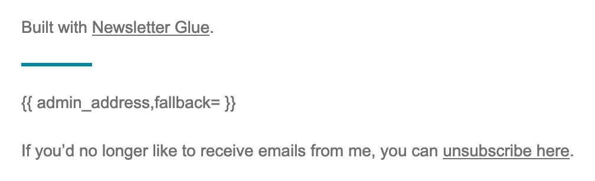

  

# BH WP NGL WP Mail

Adds `wp_mail()` as a sending option to [Newsletter Glue](https://newsletterglue.com/) for WordPress.

I already have WP Offload SES configured, which itself manages a sending queue, and all my SPF/DKIM are tuned in, so why not use it?

 sending for Newsletter Glue")

There is no way to avoid the "API key" field, so any value in there is adequate.

The plugin uses WordPress users and (currently) user roles for its mailing lists. To handle unsubscribed users, it adds a new user role `bh_ngl_unsubscribed`. The `bounced_email` role here is from [AWS SES Bounce Handler](https://github.com/BrianHenryIE/bh-wp-aws-ses-bounce-handler/).  

It integrates with Newsletter Glue's subscribe form by subscribing an existing WordPress user or creating a `WP_User` and not sending the new user email. Double-opt-in has not been developed yet.

A hash of the `WP_User` `user_registered` date and the newsletter's post id are used to create an unsubscribe link which updates the placeholder in the newsletter body.

The unsubscribe URL is also added to the emails' `List-Unsubscribe` header. Email clients know to POST to that URL, and if it is visited in a web browser, a small piece of JavaScript is used to unsubscribe the user. This way, GET requests by email clients prefetching or by spiders do not unsubscribe the user.

## Install

[Download the latest .zip from the GitHub releases](https://github.com/BrianHenryIE/bh-wp-ngl-wp-mail/releases).

## Status

This is not being used in production by me yet. Consider this incomplete, but nearly there.

The way I have used user roles for mailing lists will not scale. Roles are stored in post meta `wp_user_roles` key as an array. A more sensible way to create lists would be custom taxonomies. 

I expect there is already a good CRM type plugin that this could integrate with. Please share suggestions.

Ultimately, I'd like to be able to dynamically build mailing lists, e.g. WooCommerce customers who previously purchased product X but have not purchased it in the past 30 days. 

## See Also

* Add additional unsubscribe functionality for users with [One-Click List-Unsubscribe Mailto: Header](https://github.com/BrianHenryIE/bh-wp-one-click-list-unsubscribe-mailto-header)
* Handle bounced and unsubscribes from AWS SES using [AWS SES Bounce Handler](https://github.com/BrianHenryIE/bh-wp-aws-ses-bounce-handler/)
* Log users in automatically through links in emails with [Autologin URLs](https://github.com/BrianHenryIE/bh-wp-autologin-urls)

# Acknowledgements

Thank you to Newsletter Glue support for replying to all my emails!